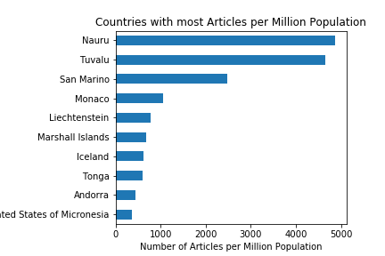
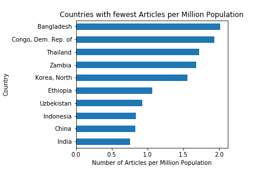
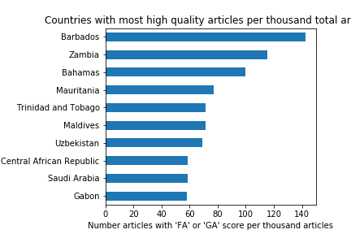
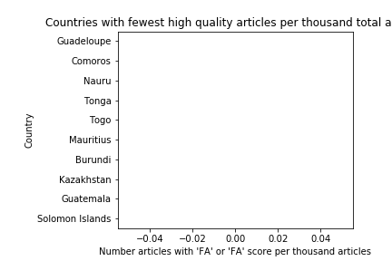

# DATA 512 Assignment 2: Bias in Data
Prepared by Alyssa Goodrich  
October 31, 2017

## Objective:  
The objective of this notebook is to explore the concept of bias in data science by examining variability of quality and quantity of data. To do this we will examine how politicians from various countries are covered on Wikipedia including quantity as well as quality of coverage. We will create four charts for this analysis including: 
- 10 highest-ranked countries in terms of number of politician articles as a proportion of country population
- 10 lowest-ranked countries in terms of number of politician articles as a proportion of country population
- 10 highest-ranked countries in terms of number of GA and FA-quality articles as a proportion of all articles about politicians from that country
- 10 lowest-ranked countries in terms of number of GA and FA-quality articles as a proportion of all articles about politicians from that country

## Data Sources Used
To create these charts, we will draw from three data sources, outlined below: 

**Source 1: Politicians by country from the English Language Wikipedia site.**
This data includes these data fields (excerpted from documentation in below website):
    1. "country", containing the sanitized country name, extracted from the category name;
    2. "page", containing the unsanitized page title.
    3. "last_edit", containing the edit ID of the last edit to the page.
- This data was extracted by Oliver Keyes and was downloaded by Alyssa Goodrich on October 30, 2017. 
- It is available at the below website:  
https://doi.org/10.6084/m9.figshare.5513449.v5
- It is saved in the file: 'page_data.csv'  
- License: Data is released under the CC-BY-SA 4.0 license.  
- Source: The data was extracted via the Wikimedia API using code available at the above link

**Source 2: Population by country**  
- This data includes: Population, by country as of mid 2015  
- This data was downloaded from this website by Alyssa Goodrich on October 23, 2017  http://www.prb.org/DataFinder/Topic/Rankings.aspx?ind=14   
- It is saved in the file: 'Population Mid-2015.csv'  
- Source: PRB 2015 World Population Data Sheet  
- Copyright © 2016, Population Reference Bureau. All rights reserved.  

**Source 3: Predicted quality scores for articles for politicians from each country**  
- This data includes quality scores generated by ORES for each article listed in source 1 above.  More information about ORES can be found here:
https://www.mediawiki.org/wiki/ORES
The data can be accessed through the API endpoint listed below
- The ORES endpoint can be found here:
https://ores.wikimedia.org/v3/#!/scoring/get_v3_scores_context_revid_model
- Licensing and terms of use not listed, assuming licesnse of CC-BY-SA
- Scores downloaded from this site include: 
    - FA - Featured article
    - GA - Good article
    - B - B-class article
    - C - C-class article
    - Start - Start-class article
    - Stub - Stub-class article


## Resources used
This analysis was prepared using Python 3.5 running in a Jupyter Notebook environment.  
Documentation for Python can be found here: https://docs.python.org/3.5/  
Documentation for Jupyter Notebook can be found here: http://jupyter-notebook.readthedocs.io/en/latest/  

The following Python packages were used and their documentation can be found at the accompanying links:  
- requests: This package supports HTTP requests. Documentation: http://docs.python-requests.org/en/master/  
- json: This package ncodes and decodes JSON data. Documentation: https://docs.python.org/2/library/json.html  
- csv: Encoding and decoding CSV documents. Documentation: https://docs.python.org/2/library/csv.html  
- numpy: This package was used for data structuring and analysis. Documentation: https://docs.scipy.org/doc/numpy-1.13.0/user/
- pandas: This package was used for data structuring and analysis. Documentation: https://pandas.pydata.org/pandas-docs/stable/
- collections: This package was used to implement special container types including ordered dictionary, default dictionary and counter. Documentation: https://docs.python.org/2/library/collections.html
- matplotlib.pyplot: This package was used to create visualizations. Documentation: https://matplotlib.org/api/pyplot_api.html


## Files Created
This notebook creates two CSV files of data extracted and compiled as part of this analysis. 

The first file is called 'ArticleQuality.csv' and includes the following fields for each article: 
- country: Country of politician that article is about
- revision_id: The ID number of the article, used to extract score
- article_quality: Score extracted from ORES data base
- population: Population of country

The second file is called 'CountrySummary.csv' and includes the following fields for each country:
- Country: Name of country
- NumberOfArticles: Total number of articles for each country,
- Population: Population of country
- ArticlesPerMillionPeople: Ratio of number articles written per million population
- NumberOfQualityArticles: Number of articles receiving a score of FA or GA
- QualityArticlesPerThousandArticles: Ratio of number quality articles per thousand total articles

## Visualizations Created




Note: These countries each have zero high quality articles. They are the ten countries with the highest total number of articles while still showing zero articles with a 'FA' or 'GA' score.


```python

```
